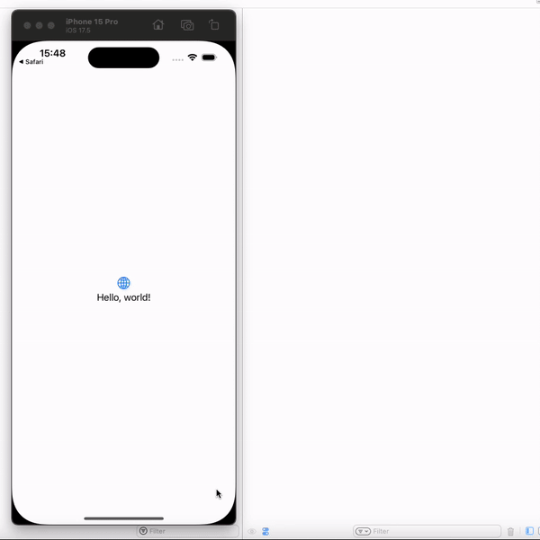

This is a SwiftUI app that was converted to use UIKit lifecycle. This project was created to test the `referrerUrl`. You can open the Safari app in the device (can be the simulator), search for `The Athletic` and tap on a result to the TA website. You should now see in the Xcode console the `referrerUrl`.

